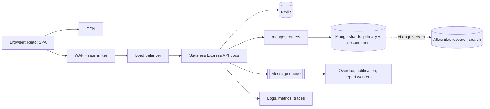

# ShelfLife at multi-library scale

**Assumptions.** ShelfLife serves 500 libraries and two million members. Search reads dominate issue/return writes by roughly 20–50:1. I assume about 150 mixed requests/second normally and 1,500 at semester-week peak. These are planning assumptions, not measured facts.



Fallback diagram (the Mermaid source is also saved as [`architecture.mmd`](architecture.mmd)):

```text
Browser → CDN / WAF → load balancer → stateless API pods
                                  ├→ Redis cache
                                  ├→ mongos → replica-backed Mongo shards → search index
                                  ├→ queue → background workers → email/SMS
                                  └→ logs, metrics, tracing
```

## (a) Architecture

The SPA is served as static assets from a CDN. API traffic crosses a WAF and rate limiter, then an L7 load balancer with health checks. Stateless Express pods can scale independently because JWTs verify locally; there is no server session or sticky routing. Redis serves cache-aside catalog data, while MongoDB runs through mongos routers to replica-backed shards. A queue moves overdue sweeps, notifications, and reports off the request path. Search can graduate to Atlas Search/Elasticsearch for fuzzy matching, fed by change streams. Centralized logs, metrics, and traces make slow cache, database, and queue paths observable.

## (b) Replica set first, shard deliberately

Start with a three-node replica set plus Redis, but design every collection with `libraryId`. At this target scale I would shard after the working set outgrows practical RAM, sustained primary writes approach its limit, or storage reaches roughly 2–4 TB. Book uses `{ libraryId, _id }`: catalog and issue queries are library-scoped and targeted, while `_id` raises cardinality beyond only 500 libraries. BorrowRecord uses `{ libraryId, member, issueDate }`, targeting member history and distributing writes. Member uses `{ libraryId, membershipId }`.

This keeps a book’s stock update on one shard. A lookup for everyone holding a particular book can scatter within a library; index `{ book, status }` and the small per-library range mitigate it. Timestamp-only keys create a hot shard, and hashed book IDs lose library targeting. Zone sharding can pin a large library or region to dedicated capacity.

## (c) Read-heavy path and caching

`GET /books` browse/search is the hot operation. Cache normalized query responses as `books:{libraryId}:{genre}:{search}:{page}:{limit}:{sort}` for five minutes plus jitter. Keep mutable availability separately at `avail:{bookId}` for 10–15 seconds, and cache genres for an hour. On catalog changes, increment a `catalogVersion:{libraryId}` in the cache key; on issue/return, only update/delete the availability key. TTL is the safety net.

Single-flight locks coalesce concurrent misses, while stale-while-revalidate serves a popular old result during refresh. Pre-warming top searches before semester week should yield a qualitative >90% catalog hit rate. Issue and return never use cached stock as their source of truth.

## (d) No negative stock across pods

The authoritative operation remains a conditional atomic update: `findOneAndUpdate({_id, availableCopies: {$gt: 0}}, {$inc: {availableCopies: -1}})`. A Book resides on one shard, and MongoDB serializes writes to that document, so the database—not a particular API pod—enforces the invariant. Optimistic version locking is correct but creates retries under a last-copy stampede. Redis locks add expiry and clock/GC failure modes without adding a stronger invariant. A per-book queue provides ordered smoothing but adds latency; reserve it for extreme hot titles. Transactions make decrement and record creation all-or-nothing but cost throughput, so compensation is the default.

Defense in depth includes `min: 0`, a Mongo JSON-schema validator, unique idempotency keys on borrow requests, the active-loan unique index, and a reconciliation job comparing stock with active loans.

## (e) Semester spike without 52-week cost

Run stateless API pods on Kubernetes/ECS with HPA based on CPU and requests/second. Scheduled pre-scaling ahead of known semester dates avoids reactive lag; scale down afterward. Redis, CDN delivery, cache pre-warming, and slightly longer peak TTLs absorb the read bulk. Use managed MongoDB autoscaling, temporary read replicas/tier upgrades, and `secondaryPreferred` for catalog reads. Queue notifications and reports, but retain synchronous issue/return. Rate limits, request timeouts, connection-pool caps, circuit breakers, and graceful degradation protect the database; a virtual waiting room is a final option. Load test at 10× before each semester with SLOs and alerts.

| Decision | Choice | Main reason | Trade-off |
|---|---|---|---|
| Data | Shard by library compound keys | Target common queries | Some book lookups scatter |
| Reads | Redis cache-aside | Removes catalog load | Briefly stale availability |
| Stock | Atomic conditional update | DB-enforced invariant | Record write needs compensation |
| Peaks | Scheduled + reactive scaling | Pay for peak weeks only | Capacity forecasting required |
